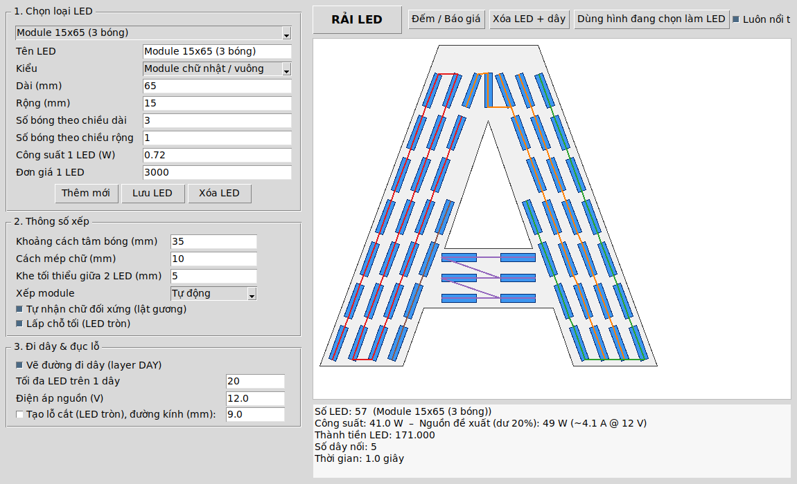

# AutoLED Pro – rải LED tự động cho CorelDRAW

AutoLED Pro tự động xếp LED vào trong chữ, theo tư duy của người thiết kế:
- tách chữ thành từng nét,
- chia đều số hàng và số cột vừa khít nét,
- tự lật gương với chữ đối xứng,
- không bao giờ để LED chồng nhau hay lấn mép.

Kết quả gồm bản vẽ LED để **khắc lên tấm alu cho thợ dán theo**, **đường đi dây** và **file lỗ cắt** cho LED lộ hoặc tôn đục lỗ.

> Phiên bản 3, viết cho **CorelDRAW 2022** (dùng được với bản 2018 trở lên).
> Các quy tắc xếp LED được giải thích trong [KINH_NGHIEM.md](KINH_NGHIEM.md). Ảnh kết quả thử nghiệm nằm trong thư mục [`ket_qua/`](ket_qua).

## Cách 1 (khuyên dùng): ứng dụng Windows – `AutoLED Pro Setup.exe`

1. Vào mục **Releases** của kho GitHub (hoặc **Actions → Dong goi AutoLED Pro → Artifacts**), tải file **`AutoLEDPro-Setup-3.0.0.exe`**.
2. Chạy file để cài. Có thể cài không cần quyền quản trị. Bộ cài tạo biểu tượng **chữ A phát sáng** ngoài Desktop và trong Start Menu.
3. Mở CorelDRAW và file thiết kế, rồi mở **AutoLED Pro**. Cửa sổ AutoLED Pro luôn nổi trên cùng, bạn đặt nó cạnh CorelDRAW.
4. Chọn chữ trong CorelDRAW, sau đó bấm **RẢI LED** trên AutoLED Pro. Ứng dụng làm 3 việc:
   - Tự đọc hình chữ đang chọn.
   - Tính toán bằng bộ máy xếp LED đã thử nghiệm.
   - Vẽ LED, dây và lỗ cắt vào CorelDRAW, đồng thời hiện ảnh xem trước và bảng báo giá ngay trong cửa sổ.
5. Muốn hủy cả lần rải thì bấm **Ctrl+Z** trong CorelDRAW một lần.

> Cần bản CorelDRAW **đầy đủ** (có Macro/VBA). Bản Home & Student thường khóa chức năng điều khiển từ ứng dụng ngoài.
> Nếu có lỗi, gửi file `%APPDATA%\AutoLEDPro\loi.txt` để được hỗ trợ.

Mã nguồn của ứng dụng nằm trong thư mục `app/`. Bộ cài được đóng gói tự động trên Windows bằng GitHub Actions (`.github/workflows/build-windows.yml`).

## Cách 2: macro VBA chạy trong CorelDRAW

### Cài đặt (làm 1 lần)

1. Tải file **`AutoLEDPro.bas`** về máy.
2. Mở CorelDRAW, bấm **Alt + F11** để mở Macro Editor.
3. Ở khung bên trái, bấm chuột phải vào **GlobalMacros** → **Import File…** → chọn `AutoLEDPro.bas`.
4. Đóng Macro Editor. Trong CorelDRAW, vào **Tools → Macros → Run Macro**, chọn **`AutoLED_CaiDat`**, bấm **Run**. Macro sẽ tự tạo cửa sổ giao diện.
5. Mở lại Macro Editor (**Alt + F11**), bấm **Save** (Ctrl+S).
6. *(Nên làm)* Gắn macro **`AutoLED`** lên thanh công cụ: **Tools → Options → Customization → Commands → Macros**.

**Nếu bước 4 báo lỗi** (CorelDRAW không cho macro tự tạo cửa sổ), bạn cài tay trong Macro Editor như sau:
1. Vào **File → Import File…** → chọn `clsAutoLEDEvt.cls`.
2. Vào **Insert → UserForm**. Trong khung Properties, đổi **(Name)** thành `frmAutoLED`.
3. Bấm đúp vào cửa sổ vừa tạo để mở phần code, xóa hết code có sẵn, dán toàn bộ nội dung file `frmAutoLED_code.txt` vào.
4. Bấm **Save**.

### Sử dụng

1. Chọn chữ cần rải LED. Được chọn chữ thường (text), chữ đã Convert to Curves hoặc cả group. Mỗi chữ nên là một đối tượng riêng.
2. Chạy macro **`AutoLED`**, cửa sổ cấu hình sẽ hiện ra:
   - **1. Chọn loại LED:** có sẵn LED tròn F9, F12, module 15×65 (3 bóng), module 12×45 (2 bóng), module vuông 35×35 (4 bóng). Bạn có thể thêm, sửa, xóa LED và lưu vào thư viện (file `%APPDATA%\AutoLEDPro\thu_vien_led.txt`).
   - **Dùng hình đang chọn làm LED:** vẽ hình LED của riêng bạn, chọn hình đó rồi bấm nút này.
   - **2. Thông số xếp:**
     - khoảng cách **tâm bóng** (thường khoảng 35mm với module),
     - cách mép,
     - khe tối thiểu giữa 2 LED,
     - kiểu xếp module: Tự động / Thẳng hàng / So le,
     - tự nhận chữ đối xứng,
     - lấp chỗ tối.
   - **3. Đi dây & đục lỗ:**
     - vẽ đường đi dây,
     - số LED tối đa trên một dây,
     - điện áp nguồn,
     - tạo lỗ cắt (với LED tròn).
3. Bấm **RẢI LED**. Máy tạo 3 layer riêng:
   - **`LED`**: các LED, mỗi chữ là một group tên `LED x <số lượng>`.
   - **`DAY`**: đường dây. Mỗi dây một màu, điểm vào có nhãn IN1, IN2…, và có đường cấp nguồn từ ô **NGUỒN**.
   - **`LO_CAT`**: các lỗ tròn để đưa ra máy CNC hoặc laser (khi chọn "Tạo lỗ cắt").
4. Bảng dưới cửa sổ báo:
   - số LED,
   - công suất,
   - nguồn đề xuất (đã cộng dư 20%),
   - thành tiền,
   - số dây.

   Bấm **Ctrl+Z** một lần là hủy toàn bộ lần rải.

#### Các macro khác

| Macro | Chức năng |
|---|---|
| `AutoLED` | Mở cửa sổ cấu hình |
| `AutoLED_RaiNhanh` | Rải ngay bằng thông số đã lưu, không mở cửa sổ |
| `AutoLED_DemLED` | Đếm LED, tính công suất và báo giá |
| `AutoLED_XoaLED` | Xóa hết LED, dây và lỗ cắt trên trang |
| `AutoLED_CaiDat` | Cài hoặc cài lại cửa sổ giao diện |

## Thư mục trong kho

| Thư mục / file | Nội dung |
|---|---|
| `app/` | **Ứng dụng Windows AutoLED Pro** (Python): bộ máy xếp, cầu nối CorelDRAW, giao diện, icon |
| `installer/` | Kịch bản bộ cài Inno Setup |
| `AutoLEDPro.bas` | File macro VBA để import vào CorelDRAW |
| `clsAutoLEDEvt.cls`, `frmAutoLED_code.txt` | Dùng khi cần cài tay |
| `src/` | Mã nguồn macro, công cụ đóng gói (`build.py`) và công cụ soát lỗi VBA (`vbacheck.py`) |
| `lab/` | Bộ thử nghiệm bằng Python: cùng thuật toán, có chấm điểm tự động |
| `ket_qua/` | Ảnh kết quả và bảng điểm của bộ thử nghiệm |
| `KINH_NGHIEM.md` | 30 quy tắc xếp LED rút ra từ quá trình tự thử |
| `prototype/` | Các bản thử đầu tiên (lưu lại để tham khảo) |

## Lưu ý

- Chữ phải là **đường cong kín**.
- Chữ **đối xứng** (A, H, O, T, V…) chỉ được xếp đối xứng khi mỗi chữ là **một đối tượng riêng**.
- Máy chủ phát triển không có CorelDRAW, nên macro bản 3 **chưa được chạy trên CorelDRAW thật**. Thuật toán đã được thử kỹ trên bản Python cùng logic (thư mục `lab/`). Nếu macro báo lỗi, bạn chụp màn hình dòng lỗi gửi lại để tôi sửa.
